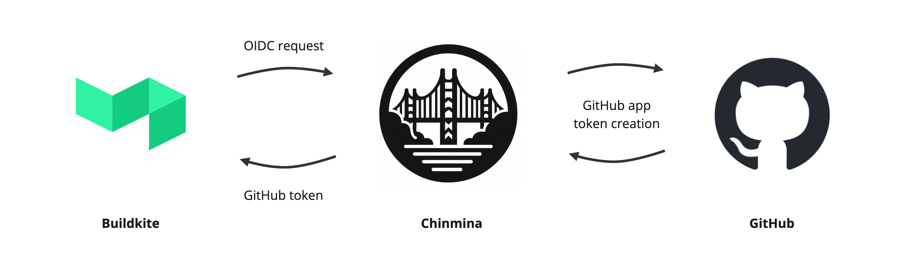

**Connect Buildkite to GitHub with secure, short-lived tokens.**

Chinmina Bridge is a simple web service that acts as an intermediary between a
Buildkite installation and a related [GitHub App][github-app]. Buildkite agents can request
[ephemeral GitHub access tokens][github-app-tokens] from Chinmina Bridge, removing the need to store
Deploy Keys or Personal Access Tokens long term.

## Benefits

There are two substantial benefits here:

### 1. Security

1. The potential impact of a compromised token is lowered. Tokens are valid for
   a maximum of one hour, and only provide read access to the pipeline
   repository.
2. Issuing keys per repository is no longer required. This often requires
   elevated repository permissions, and keys issued to individuals have a higher
   potential to be accidentally leaked.
3. The number of keys requiring storage is significantly decreased. The GitHub
   app private key is stored: no other token storage is required.
4. With KMS, the highly sensitive private key cannot be extracted. When configured
5. Auditing

### 2. Flexibility

Once configured, Buildkite pipelines get automatic read access to their source
repository. This reduces complexity in the provisioning process.

## Drawbacks

1. You need to host the service, and keep it up. Given that it is a simple,
   containerized HTTP service, this is thankfully relatively straightforward.
2. The private key for the GitHub application is quite powerful, and needs to be
   carefully protected. It has the superset of permissions that it can delegate.
   Storing the key in AWS KMS and using careful resource and IAM policies on
   access is therefore strongly recommended.
3. Adequate controls are required on Buildkite pipeline creation. At present,
   the bridge will allow access by the pipeline to the configured repository.
   Controls are required to ensure that repository access is appropriately
   limited.[^1]

[^1]:
    Changing this behaviour is a short-term goal. In upcoming releases,
    configuration will be required in order to enable repository access.

## How it works

Chinmina Bridge accepts HTTP connections from Buildkite agents. The request
includes a [Buildkite OIDC][buildkite-oidc] token that is used to authorize
requests.

The token identifies the Buildkite pipeline that is executing, so the associated
repository can be looked up.

If the request is valid, GitHub is used to create an app token with
`contents:read` permissions on the pipeline's repository. This token has a
maxiumum lifetime of an hour (due to caching it may only last for 45 minutes
however).

Three endpoints are exposed:

- `/token`, which returns a token and its expiry, and
- `/git-credentials`, which returns the token and repository metadata in the
  [Git Credentials format][git-credential-helper].
- `/healthcheck`, which returns 200. It is used for healthcheck requests from
  load balancers and the like.

[github-app]: https://docs.github.com/en/apps
[github-app-tokens]: https://docs.github.com/en/apps/creating-github-apps/authenticating-with-a-github-app/generating-an-installation-access-token-for-a-github-app
[buildkite-oidc]: https://buildkite.com/docs/agent/v3/cli-oidc
[git-credential-helper]: https://git-scm.com/docs/gitcredentials#_custom_helpers
